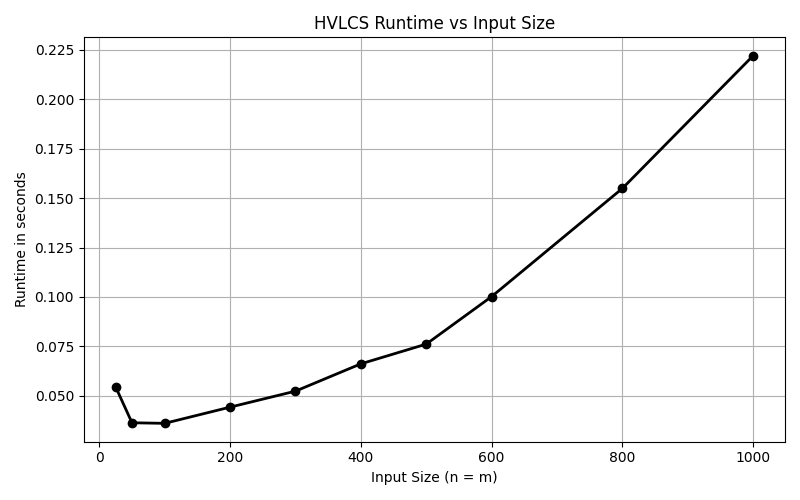

README file for Highest Value Longest Common Sequence:

Team members:
Jade Vega UFID: 80117435
Valentina UFID: 99166716

Instructions for running program:
-set your terminal as command prompt
-run the following:
python main.py < <input file>

For example:
input:
python main.py < example.in
output:
17
eabce

Another example using the input files:
input:
python main.py < data/file1.in
output:
84
cfbedefbfecad

Written Component:
Question 1

Question 2

If we let dp[i][j] be equal to the maximum value of a common subsequence of A[1..i] and B[1..j]

Then we can say the base cases are as follows:
dp[i][j] = 0 for all i greater than or equal to 0
and
dp[0][j] = 0 for all j greater than or equal to

The recurrence would be as follows:
If A[i] == B[j]: dp[i][j] = max(v(A[i]) + dp[i-1][j-1], dp[i-1][j], dp[i][j-1])
and
If A[i] != B[j]: dp[i][j] = max(dp[i-1][j], dp[i][j-1])

The recurrence is correct because neither character can form a matching pair when A[i] != B[j]. This means that the best solution will exclude A[i] or exclude B[j]. Now when A[i] == B[j], we have another option which will include the matching chatacter. It will also gain v(A[i]) for the remaining prefixes dp[i-1][j-1]. All values here are nonnegative so we are able to take the max over all options and we are able to obtain the globally optimal value proving that the recurrence is correct.

Question 3

pseudocode:
HVLCS(A, B, v):
    n = |A|, m = |B|
    create (n+1) x (m+1) table dp, initialized to 0

    for i = 1 to n:
        for j = 1 to m:
            if A[i] == B[j]:
                dp[i][j] = max(v(A[i]) + dp[i-1][j-1], dp[i-1][j], dp[i][j-1])
            else:
                dp[i][j] = max(dp[i-1][j], dp[i][j-1])

    return dp[n][m]

The runtime of the algorithm is O(n*m) because the dynamic programming table has (n+1)(m+1) cells. Each cell takes O(1) to compute. And backtrackning traces a path through the table in O(n+m) time, so that is the overall runtime.